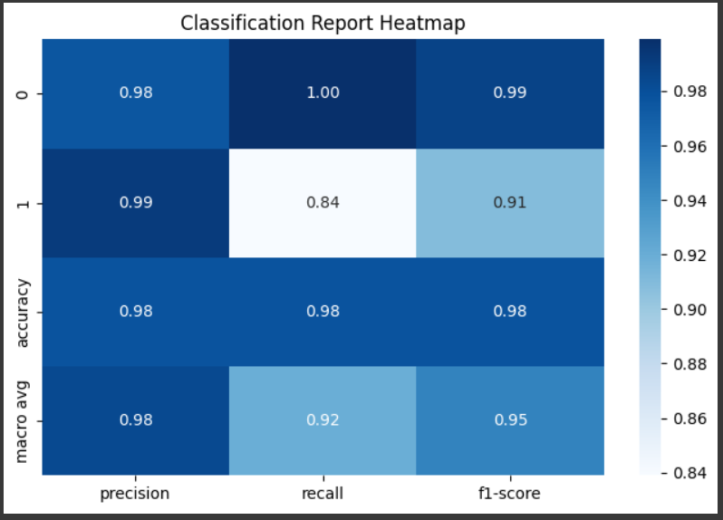
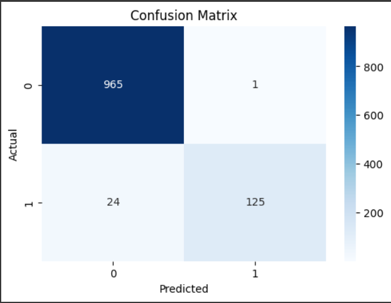

# 📧 Email Spam Classification

This project builds a machine learning model to classify emails as **spam** or **ham (not spam)**.  
The model uses **TF-IDF** for feature extraction and **Naive Bayes** for classification.  
It was developed in **Google Colab** with Python and scikit-learn.  

---

## 📂 Project Structure
'''
├── plots/  
│ ├── Classification_Report_heatmap.png # Heatmap of precision, recall, f1-score  
│ └── confusion_matrix.png # Confusion matrix visualization  
├── Email_Spam_Classification_Report.pdf # Detailed professional report  
├── Email_spam_classification.ipynb # Colab notebook with full code  
└── README.md # Project documentation  
'''

---

## 🚀 Methodology
1. **Data Preprocessing**
   - Removed extra characters, converted text to lowercase
   - Applied TF-IDF vectorization  

2. **Model Training**
   - Split data into 80% training and 20% testing
   - Used **Multinomial Naive Bayes classifier**  

3. **Evaluation**
   - Accuracy score
   - Precision, recall, F1-score
   - Classification heatmap & confusion matrix  

---

## 📊 Results

### Classification Report Heatmap


### Confusion Matrix


---

## 📝 Report
For full details on methodology, experiments, and conclusions, see:  
📄 [Email_Spam_Classification_Report.pdf](Email_Spam_Classification_Report.pdf)

---

## ⚙️ Requirements
To run this project, install dependencies:
```bash
pip install -r requirements.txt
pandas
numpy
scikit-learn
matplotlib
seaborn
